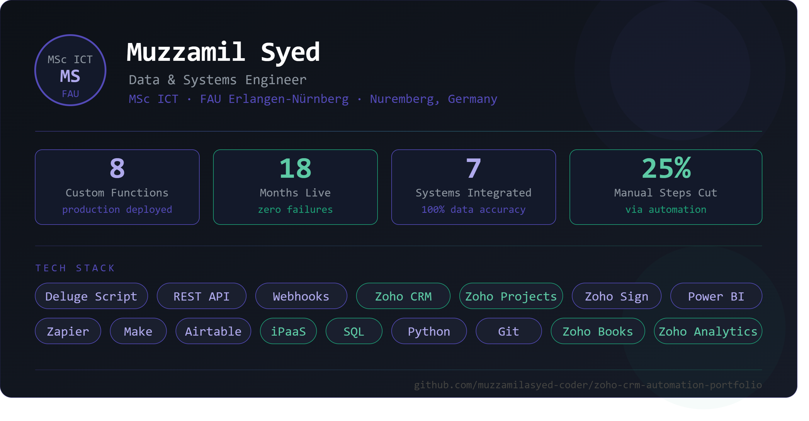

# Zoho CRM Automation Portfolio
### Muzzamil Syed — Low-Code Developer & CRM Systems Engineer

This portfolio contains production-grade automation functions, cross-system
integrations, and analytical SQL built and deployed in a live B2B operations
environment over 18 months.

All functions ran in production without failure.
Company-specific identifiers have been anonymised.

---

## Tech Stack
Zoho CRM · Zoho Projects · Zoho Sign · Zoho WorkDrive · Zoho Books ·
Zoho Analytics · Deluge Scripting · REST API · Webhooks · SQL · Python

---

## Projects

| # | Project | Category | Complexity |
|---|---------|----------|------------|
| 1 | [Create Project from CRM Deal](./projects/01-create-project-from-deal.md) | CRM × Project Integration | Very High |
| 2 | [Send Purchase Agreement via Zoho Sign](./projects/02-send-agreement-zoho-sign.md) | Document Automation | Very High |
| 3 | [Resend Agreement with Recall Logic](./projects/03-resend-agreement-recall.md) | Document Automation | Very High |
| 4 | [Open WorkDrive Folder with Attachment Migration](./projects/04-open-workdrive-folder.md) | File Management | High |
| 5 | [WorkDrive Sync on Lead Conversion](./projects/05-workdrive-sync-lead-conversion.md) | File Management | Medium |
| 6 | [Sync Project Manager from Analytics to CRM](./projects/06-sync-project-manager-analytics.md) | Data Reconciliation | High |
| 7 | [Send Client Portal Invitation](./projects/07-client-portal-invitation.md) | CRM × Billing Integration | High |
| 8 | [Auto-Update Deal Stage to Unresponsive](./projects/08-update-deal-stage-unresponsive.md) | Sales Automation | High |
| 9 | [Live Project Operations Dashboard — SQL](./projects/09-live-operations-dashboard-sql.md) | Analytics & Reporting | Very High |

---

## Connect
- LinkedIn: [linkedin.com/in/muzzamilsyed](https://linkedin.com/in/muzzamilsyed)
- Email: muzzamil.asyed@gmail.com
- Portfolio: [github.com/muzzamilasyed-coder/zoho-crm-automation-portfolio](https://github.com/muzzamilasyed-coder/zoho-crm-automation-portfolio)
